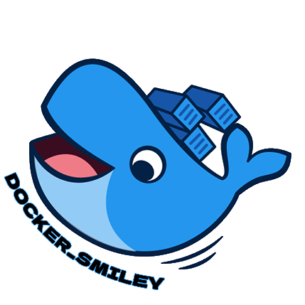
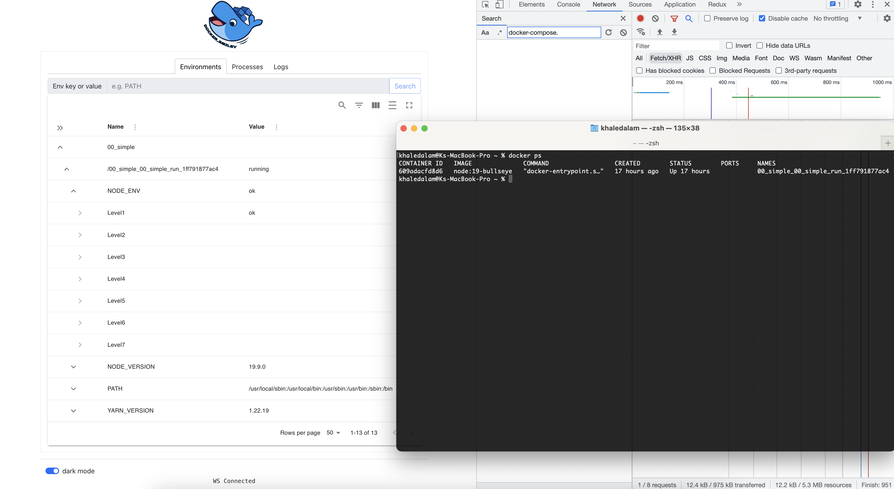

<h1 align="center">
Docker_Smiley 
</h1>

---

Docker_smiley is a small application with a web based interface to reverse engineering Docker containers' environment variables precedence and monitor Docker containers' processes and logs in real time.

Written in [Go](https://github.com/golang/go) and [React](https://github.com/facebook/react).

---

---

## Sharing the journey of the development process in public.

- [ ] Environments
  - [x] listing: apps -> containers -> envs -> 7-levels
    - [x] level 1 (Set using docker compose run -e in the CLI)
    - [ ] level 2 (Substituted from your shell)
    - [ ] level 3 (Set using the environment attribute in the Compose file)
    - [ ] level 4 (Use of the --env-file argument in the CLI)
    - [ ] level 5 (Use of the env_file attribute in the Compose file)
    - [ ] level 6 (Set using an .env file placed at base of your project directory)
    - [ ] level 7 (Set in a container image in the ENV directive. Having ARG or ENV setting in a Dockerfile)
  - [ ] struct subRows levels in horizontal orientation
  - [ ] cache table builtin functionalities [e.g. # of rows] and fix search in subRows
  - [ ] tooltip each level explanation
  - [ ] Add exporting functionality
  - [ ] TBD
- [ ] Processes 
  - [ ] TBD
- [ ] Logs
  - [ ] TBD
---

- [ ] General
  - [ ] readme.md 
  - [ ] github actions
  - [ ] basic auth
  - [ ] documentation
  - [ ] testing
  - [ ] dark mode
  - [ ] containerize application
  - [ ] test on Linux and Windows environments (currently on mac only)
  - [ ] remove unused packages
  - [ ] add examples
  - [ ] TBD

---

frontend:
`npm run start` or `yarn run start`  
http://localhost:3000/

backend:
`GIN_PORT=8010 gin run main.go` 
http://localhost:8010/

